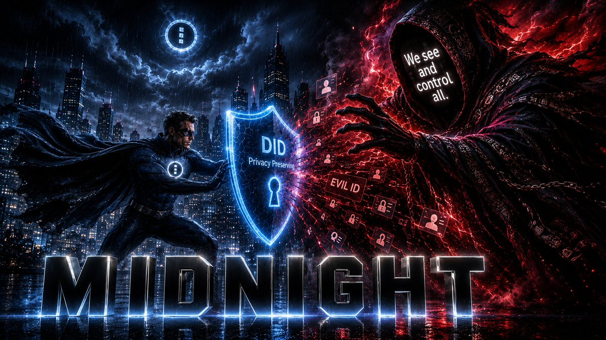

# RWAz

> **Midnight technical rule:** In the DIDzMonolith checkout, follow the [DIDzM sources-of-truth policy](../DIDzMonolith-docs/midnight/MIDNIGHT_SOURCES_OF_TRUTH.md) for source routing and the [current Midnight schema](../DIDzMonolith-docs/midnight/MIDNIGHT_CURRENT_SCHEMA.md) for architecture, integration, and evidence labels.

**Real-world asset identity, ownership, encumbrance, and provenance for DIDzM, on Midnight.**

> **DIDzM alignment, July 13, 2026:** RWAz is one of the four DIDzM engines.
> DIDz supplies permanent subject identity and shared credential primitives. RWAz
> owns transferable ownership, encumbrance, custody, fractional interests, and
> provenance semantics. AgenticDID owns agent authority, and HelixCTW is the
> data-layer engine. Implementation claims in this document are limited to the
> compiler and structural-test evidence stated below; they do not imply audit or
> production deployment.

RWAz is the real-world-asset and object engine in the DIDzM architecture:

```text
DIDzM
├── DIDz .......... root identity, issuer trust, credentials, lifecycle
├── AgenticDID .... agent identity, bounded authority, delegation
├── RWAz .......... asset identity, ownership, encumbrance, provenance
└── HelixCTW ...... private data orchestration and query (data layer)
```

Where AgenticDID answers "what may this agent do," RWAz answers "what is this
asset, who owns it right now, and what is its provenance," without conflating the
asset's permanent identity with its changeable ownership.

---

## The DIDzM Premise

The world's digital verification system is on its head. You must submit large
amounts of personal information to prove a single thing — something that is
really just a yes-or-no question:

> *Does this person meet this minimum (or maximum) requirement?*

Midnight flips this by answering **only the necessary question** with
mathematical certainty of truthfulness for the asker:

- Are you old enough?
- Are you a non-felon?
- Do you have an XYZ degree?
- Do you have a valid driver's license?
- Do you live within X miles of the job you are applying for?
- Do you have allergies?
- Do you have medical insurance?
- Do you qualify for this loan?
- Do you have a reputation for XYZ?
- Do you rightfully own this asset?
- Do you have the authority to open this door?

Every question above is a **yes or no**. Today, answering any one of them
requires surrendering your full identity, your documents, your history, and your
privacy to a stranger who will store it in a database that will eventually be
breached. DIDzM answers each with a zero-knowledge proof — mathematically
certain, cryptographically verifiable, and revealing **nothing** beyond the
answer itself. RWAz extends this to **assets and objects**: prove you own it,
prove it's encumbered, prove its provenance — without exposing ownership records,
titles, or transaction history.

---

## The one rule RWAz inherits from DIDz

> Do not confuse identity with authority.
>
> A DIDz proves an entity exists or existed. Credentials prove claims. Ownership
> is a credential, not the identity.

The VIN stays with the car. The title changes when the car is sold. RWAz makes
that pattern first-class for every kind of object and asset.

## Why RWAz is its own repo

Real-world assets are a large domain in their own right:

- **Ownership transfer** as a transferable credential (not a mutation of identity)
- **Encumbrances**: lien, insurance, inspection, warranty, escrow credentials
- **Provenance**: an auditable chain of custody and title history
- **Fractional ownership / tokenization** of a single underlying asset
- **Custody** and controller relationships
- **Lifecycle**: active, sold, destroyed, lost, seized, retired, superseded
- **Regulatory surface**: securities-style rules for tokenized RWAs

This is comparable in weight to the scoped-grant and delegation machinery that
justifies AgenticDID being its own repo.

## What RWAz does NOT own

RWAz does not re-implement the shared identity primitives. Those live once in the
DIDz root layer and in `midnight-modules` (entity registry, lifecycle status,
credential registry, merkle membership, commitment/nullifier, recovery). RWAz
imports them and adds only the ownership and provenance layer. This prevents three
drifting copies of the same registry across DIDz, AgenticDID, and RWAz.

### Planned NIGHTGATE service edge

NIGHTGATE may transport approved RWAz contract calls, project selected OData
fields, anchor document commitments, and request ownership or encumbrance
predicates. It is an adapter boundary, not a registry, title authority,
ownership authority, fifth DIDzM engine, or source of RWAz protocol semantics.
The RWAz contracts and verified provenance chain remain authoritative.

NIGHTGATE-MCP is a planned Ai tool bridge. Its bearer grants authorize
transport requests only and do not prove ownership, title, custody, DID
control, or AgenticDID authority. Never place title documents, wallet seeds,
bearer tokens, private evidence, or ZK witnesses in repository files,
examples, fixtures, logs, telemetry, or tool prompts.

## Entity types RWAz covers

```text
ObjectDIDz ....  physical objects (machine, server, robot, medical device,
                 shipping container, Raspberry Pi)
RWADIDz .......  real-world assets (house, car, land parcel, diamond, painting,
                 gold bar, tokenized treasury)
```

## Credential model (sketch)

```text
CarDIDz            = this specific car exists (permanent)
TitleCredential    = who owns it right now (transferable)
LienCredential     = a lender's claim
InsuranceCredential= current insurance status
InspectionCredential = current inspection status
ProvenanceRecord   = auditable chain of prior titles/custody
```

## Ecosystem consumers

RWAz is designed to be the shared substrate that today's RWA-adjacent DIDz
products build on instead of reinventing ownership:

- `SilentLedger` (asset verification, private orderbooks)
- `equineProData`, `petProData` (animals as real-world assets)
- `LegacyKey` (loose estate, inheritance, and recovery ideation; not an established RWAz consumer or subsystem)
- `safeHealthData` (medical devices as objects)
- tokenized-treasury and fractional-ownership use cases

## Status

**Implemented** (July 2026, compactc 0.31.1):
- `rwa_registry.compact`, 6 circuits: register, transfer, assert_i_own, add/release encumbrance, retire
- `rwa_credentials.compact`, 5 circuits: issue, revoke, prove, is_live, advance_epoch

Compiles clean with full ZK key generation. Privacy-first per ruling #0.

## Documents

- `docs/ARCHITECTURE.md`, RWAz architecture
- `docs/DIVISION_OF_LABOR.md`, exactly what belongs in DIDz root vs RWAz
- `docs/AUTHORITY_TIERS_DATA_ACCESS.md`, authority-tiered data access and the planned NIGHTGATE projection boundary
- `ROADMAP.md`, phased build plan
- `contracts/README.md`, planned contracts

## Author

John M.P. Santi, EnterpriseZK Labs LLC. Part of the DIDz ecosystem.

---

## DIDz Ecosystem

This project is part of the DIDz ecosystem, a suite of privacy-preserving
identity, credential, and application tools built on Midnight Network.


See the full ecosystem map above, or visit [didz.io](https://didz.io) for details.

---

## The Existential Threat



The convergence of autonomous Ai, mass surveillance, and centralized identity databases creates an existential threat to human autonomy. Every digital interaction becomes a data point in someone else's database. Every Ai agent operates without verifiable accountability. Every centralized identity system is a breach waiting to happen.

**DIDzMonolith is the architectural answer.** Four engines, one ecosystem, zero-knowledge proofs on Midnight Network:

| Engine | Role | What It Proves |
|--------|------|----------------|
| **DIDz** | Root identity layer | Who you are, without revealing who you are |
| **AgenticDID** | Agent authority layer | That an Ai agent is authorized, without revealing by whom |
| **RWAz** | Object/asset identity layer | What an asset is and who owns it, without exposing ownership data |
| **HelixCTW** | Data-layer engine | Query and manage private data, without exposing raw facts |

**This project** is part of the DIDzMonolith ecosystem, built on these four engines. The existential threat is real. The architecture is ready.

---

## Regulatory Compliance

This project is part of the DIDzMonolith ecosystem and inherits the four-engine ZK architecture (DIDz + AgenticDID + RWAz + HelixCTW) that provides privacy-by-design advantages for regulatory compliance.

**Applicable frameworks**: SOC 2, ISO 27001, PCI DSS, HIPAA, MiCA — depending on product function and jurisdiction.

**Full compliance deep dive**: [`DIDzMonolith-docs/compliance/REGULATORY_COMPLIANCE_DEEP_DIVE.md`](../DIDzMonolith-docs/compliance/REGULATORY_COMPLIANCE_DEEP_DIVE.md) — engine-by-engine control mappings, product compliance matrix, and implementation roadmap.

**MiCA regulatory notes**: [`DIDzMonolith-docs/compliance/MICA_REGULATORY_NOTES.md`](../DIDzMonolith-docs/compliance/MICA_REGULATORY_NOTES.md) — EU crypto-asset regulation product-by-product matrix.

---
